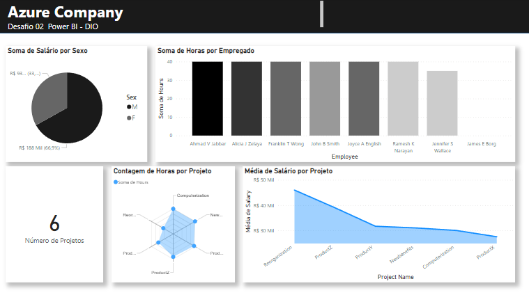

# Desafio 02 - Power BI
## Santander Bootcamp 2023 - Ciência de Dados com Python

Nesse desafio, realizei a criação de uma instância na Azure para MySQL. O processo foi bastante desafiador, pois é uma ferramenta com a qual nunca tive contato, mas após algumas tentativas, obtive sucesso. 
Em seguida, crei um banco de dados com a base disponibilizada no [repositório](https://github.com/julianazanelatto/power_bi_analyst/tree/main/M%C3%B3dulo%203/Desafio%20de%20Projeto) fornecido pela tutora.

Integrei também o Power BI com o MySQL no Azure e iniciei o processo de verificação da base para transformar os dados.

No decorrer da minha análise, tomei algumas medidas para aprimorar a qualidade e a utilidade dos dados. Em primeiro lugar, eliminei as colunas que não trariam relevância ao meu escopo de análise. Além disso, efetuei alterações nos cabeçalhos das colunas, visando uma identificação mais intuitiva durante a elaboração do relatório.
Na tabela "Departament", procedi com a exclusão das colunas e da "Mgr_start_date". Na tabela "Employee", realizei uma divisão na coluna de endereços, isolando o estado em uma coluna separada. Esse processo foi executado por meio da opção "Dividir Colunas" na página inicial, utilizando como critério o número de caracteres.
Outra modificação realizada foi a alteração do tipo de dados da coluna "salary" na tabela "Employee" para decimal fixo. Adicionalmente, criei uma nova coluna mesclando os campos "Fname", "Minit" e "Lname", utilizando a função de mesclagem de colunas com espaço como separador. Nessa análise específica, a separação dos nomes não acrescentava utilidade ao relatório.
A seguir, realizei a mesclagem das tabelas "Departament" e "Dept_location" para uma melhor visualização da distribuição geográfica dos departamentos. Identifiquei nesse processo a presença do departamento "Research" em mais de uma cidade, eliminei colunas duplicadas e uni os nomes de local e departamento para criar um identificador único.
A consolidação das informações continuou com a mesclagem das tabelas "Employee" e "Works_on" para identificar os projetos e as horas dedicadas por cada profissional. Para otimizar os resultados, mesclei a tabela resultante com a tabela "Project", proporcionando insights adicionais sobre os nomes dos projetos e seus locais correspondentes. A nova tabela gerada contém dados relevantes, como o nome do funcionário, horas dedicadas, nome do projeto e local.
É válido ressaltar que, embora os processos de MESCLAR e COMBINAR tenham parecido iguais à primeira vista, se revelaram distintos em sua execução e impacto nos dados:
No Power BI, "mesclar" seria a junção de tabelas com base em uma coluna comum, enquanto "combinar" envolve adicionar linhas de uma tabela a outra. Mesclar cria uma nova tabela com base nas correspondências, enquanto combinar anexa dados verticalmente. 
Por fim, após todas essas transformações e melhorias nos dados, encerrei o processo aplicando as alterações. No relatório, elaborei as seguintes visualizações:

- Soma de horas por empregado
- Soma de salário por sexo
- Número de projetos
- Contagem de horas por projeto
- Média de salário por projeto
  
O relatório gerado pode ser visualizado na imagem abaixo:

